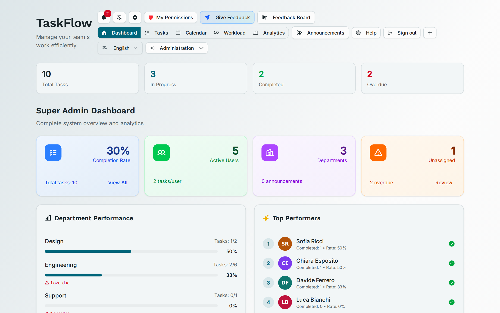
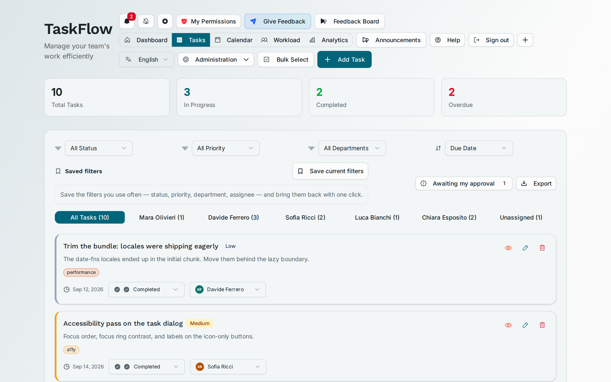
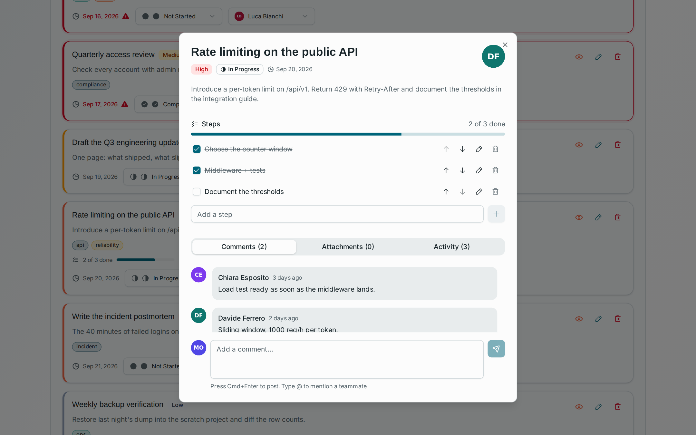
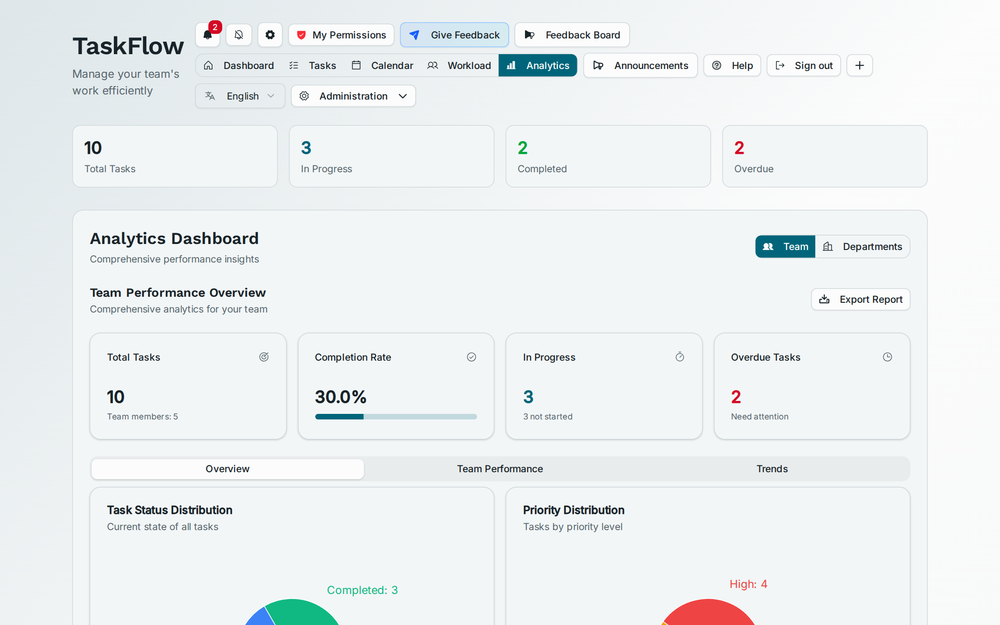
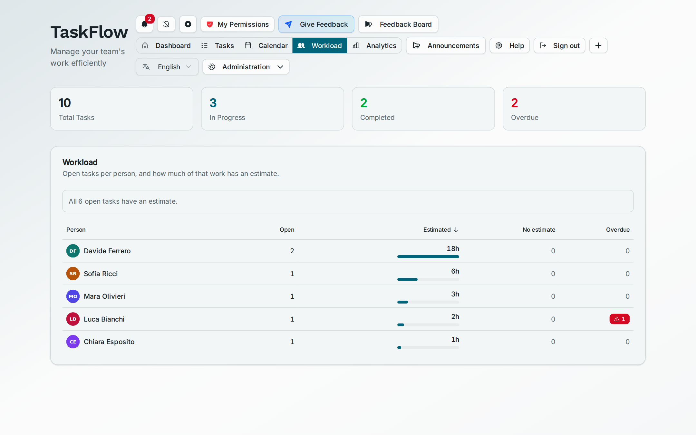
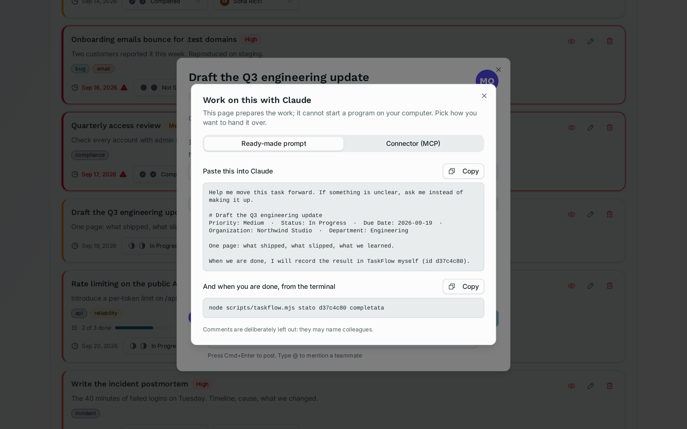

<div align="center">

# TaskFlow

**Team task management where the permissions are real.**

Multi-tenant task tracking for organisations — people, roles, departments,
approvals, real-time notifications and email. Authorisation lives in the
database, not in the buttons.

[](https://react.dev)
[](https://www.typescriptlang.org)
[](https://supabase.com)
[](https://vite.dev)
[](#testing)
[](#hand-a-task-to-claude)
[](LICENSE)

[Italiano](README.it.md) · [Install guide](INSTALL.md) · [Product notes](PRD.md)



</div>

---

## What makes it different

Most task managers hide the buttons you are not allowed to press. This one
does that too — and then **refuses the operation in the database as well**, so
hiding the button is a courtesy rather than the security model.

| | |
| --- | --- |
| **Authorisation in Postgres** | Every application table has Row Level Security. A task is a row in `public.tasks` with per-row policies; a notification is readable only by its recipient. Turning off the UI check changes nothing. |
| **Rules that hold everywhere** | A task blocked by another cannot be closed — from the interface, from the CLI, or from an AI assistant. The rule is a database trigger, so there is no path around it. |
| **Server-only secrets** | The service-role key and the mail and AI keys exist only in `api/`, which runs on the server. The browser bundle never sees them. |
| **Approvals that mean something** | "Completed" and "completed and signed off" are different states, and every count in the product knows the difference. |
| **No switch that does nothing** | A settings panel offered forty-two options; one was actually read. The other forty-one were removed rather than left pretending — including "enable 2FA" and "IP whitelist", which is a lie you do not want on a security feature. |

## Screens

<table>
<tr>
<td width="50%"><br><sub><b>Tasks</b> — filters, saved views, per-person tabs, bulk actions, export.</sub></td>
<td width="50%"><br><sub><b>Detail</b> — steps, comments with @mentions, attachments, full history.</sub></td>
</tr>
<tr>
<td><br><sub><b>Analytics</b> — completion rate, status and priority distribution, trends.</sub></td>
<td><br><sub><b>Workload</b> — who is carrying what, before you assign the next thing.</sub></td>
</tr>
</table>

<sub>These are the real interface, photographed by a script in this repository,
with an invented organisation. See [How the screenshots are made](#how-the-screenshots-are-made).</sub>

## Hand a task to Claude

Assigned work can be handed to [Claude](https://claude.ai) two ways.



**1. The MCP connector** — the good path.

```bash
node scripts/mcp/taskflow.mjs --installa    # then restart Claude Desktop
```

In more than one organisation? Add `--org <id or name>`: Claude Desktop is
started by an icon, not a terminal, so the choice has to be written into the
configuration rather than exported in a shell.

Four tools: list your tasks, read one, change a status, add a note.

They write the history and send the **in-app** notifications — to watchers, to
whoever holds the task, to whoever asked for it. They do **not** send the
emails, and they do not recognise `@Name` mentions: those stay with the
interface, and the tool descriptions say so rather than letting you find out.

It runs **with your permissions, not the server's**. It reuses your CLI session
and talks to PostgREST with your token — never a service key. So a model in
there cannot do anything you could not do yourself from the browser: the same
RLS policies, the same triggers, including the one that refuses to close a
blocked task.

**2. The button** — for people using Claude in a browser.

It *prepares* the handover; it cannot start a program on your computer, and it
says so on screen instead of letting you find out. Comments are deliberately
left out of the generated text: they name colleagues, and that text is made to
be pasted somewhere else.

There is also a plain CLI:

```bash
node scripts/taskflow.mjs accedi     # once
node scripts/taskflow.mjs elenco
node scripts/taskflow.mjs stato 3f2a9c10 completata "what I did"
```

## Features

- **Tasks** — assignment, status, priority, due dates, steps, labels, comments
  with @mentions, attachments, dependencies, recurrence, full activity history.
- **People and roles** — `owner`, `admin`, `manager`, `member`, `viewer`, plus
  per-person overrides. Accounts are created by an administrator; there is no
  public sign-up.
- **Departments** with per-department and per-person analytics.
- **Approvals** — work that needs a sign-off is not counted as done until it
  has one.
- **Notifications** in real time, with per-person preferences: which types,
  quiet hours, sound.
- **Email** on assignment, via Resend or SendGrid, sent only from the server.
- **Scheduled jobs** — reminders, daily digests, recurrence, archiving,
  escalation.
- **Backup and restore** of an organisation's data.
- **Five languages** — English, Italian, French, German, Spanish.
- **Optional AI** — assistant, auto-assign, estimates, insights. Without an API
  key these simply stay hidden; the application works without them.

## How it is built

- **Frontend** — React 19 + TypeScript, Vite, Radix/shadcn, Tailwind CSS 4.
- **Auth and data** — Supabase (Postgres + Auth), RLS on every application table.
- **Server functions** — `api/`, run by Vercel. The only place secrets live.
- **Migrations** — `supabase/migrations/`, numbered, applied in order.

### Where authorisation lives

In the database, not in the components. The permission checks in the interface
exist so you are not shown commands you cannot use; what actually refuses an
operation is the RLS policy, or a route in `api/` that runs with elevated
privileges and re-checks the caller's role.

In practice:

- tasks are rows in `public.tasks`, with per-row policies: anyone who may write
  can create; the author, the assignee or a manager may edit; the author or a
  manager may delete;
- notifications are rows in `public.notifications`, readable only by their
  recipient;
- the remaining application state (`app_state`) separates configuration keys,
  restricted to managers and administrators, from everyday working keys.

## Quick start

Full guide in **[INSTALL.md](INSTALL.md)**, including the two configuration
traps that cost the most time. In short:

```bash
npm install
cp .env.example .env.local          # and fill it in
supabase link --project-ref <ref>
supabase db push                    # applies ALL migrations, in order
                                    # (new project only — see INSTALL.md)
vercel dev                          # frontend + api/ functions
```

## Testing

```bash
npm run test        # unit (Vitest)
npm run typecheck
npm run lint
npm run build
```

**725 tests in 46 files.** They cover the permission matrix per role and its
overrides, sanitisation of anything that reaches the DOM, identifier
uniqueness, settings that survive malformed data, translations, recurrence,
the email digest, escalation, steps, task dependencies, labels, mentions,
export, approvals, reminders, server-side task creation, which columns go into
an UPDATE, and the shared core behind the CLI and the MCP connector.

Every one of those areas is a place where a real defect was found. The tests
describe the correct behaviour so it does not come back.

There is also an integration check against a real Supabase project:

```bash
node scripts/smoke-auth.mjs
```

It verifies that public sign-up is closed, that administrator-created accounts
work, and that existing accounts resolve their organisation. Re-run it after
any change to the auth configuration: a mistake there locks everybody out.

The MCP connector is the exception: it is exercised as a real process, spoken
to over stdio by a real MCP client against a local fake of the API. That is how
the session tests can assert *which token a request went out with* — not just
what the answer said.

**What the suite does not cover**: there are no browser end-to-end tests — the
screenshot script drives a real browser but asserts nothing, it takes pictures.
React components are mounted in jsdom only where a defect made it necessary:
three of about a hundred (the calendar, the data-management panel, the lazily
loaded calendar), plus one hook. Coverage is on pure logic and on the critical
paths, not on the whole interface.

## How the screenshots are made

```bash
npm run immagini
```

This builds the app and drives it in a real browser with an invented
organisation — fictional people, fictional tasks — replacing only the network.
The responses have PostgREST's shape, so they go through the same mappers that
read the real database.

Two reasons it works this way. Real screenshots would publish real people's
working days: who is late, who commented what. And a mockup would show an
interface that does not exist — here, if a mapper breaks, the images break
with it. It found a real bug the first time it ran: the interface was
translated into five languages and the text it generated for Claude was not.

## Contributing

Issues and pull requests are welcome. Before opening a PR:
`npm run test && npm run typecheck && npm run lint && npm run build`.

If the change touches permissions, RLS policies or authentication, say in the
description **which operation becomes possible, and for whom**. That is the
part that needs the most care in review.

## License

[MIT](LICENSE).
